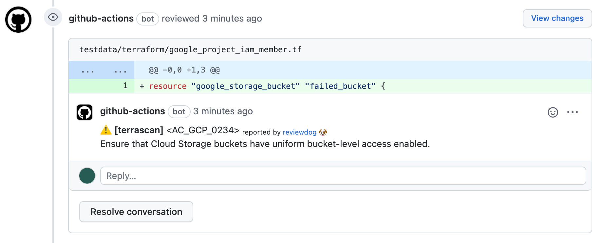

# action-terrascan

<!-- TODO: replace yu-iskw/action-terrascan with your repo name -->
[](https://github.com/yu-iskw/action-terrascan/actions?query=workflow%3ATest)
[](https://github.com/yu-iskw/action-terrascan/actions?query=workflow%3Areviewdog)
[](https://github.com/yu-iskw/action-terrascan/actions?query=workflow%3Adepup)
[](https://github.com/yu-iskw/action-terrascan/actions?query=workflow%3Arelease)
[](https://github.com/yu-iskw/action-terrascan/releases)
[](https://github.com/haya14busa/action-bumpr)



This is a github action to scan IaC files with terrascan and reviewdogs.

## Input
Please see [action.yml](./action.yml) as well.
The documentation can be outdated as we update the action.

```yaml
inputs:
  github_token:
    description: 'GITHUB_TOKEN'
    required: true
  working-directory:
    description: 'Working directory relative to the root directory.'
    required: true
  ### reviewdog ###
  reviewdog_version:
    description: "reviewdog version"
    default: "latest"
    required: false
  ### Flags for reviewdog ###
  level:
    description: 'Report level for reviewdog [info,warning,error]'
    default: 'error'
    required: false
  reporter:
    description: 'Reporter of reviewdog command [github-check,github-pr-review].'
    default: 'github-check'
    required: false
  filter-mode:
    description: |
      Filtering mode for the reviewdog command [added,diff_context,file,nofilter].
      Default is added.
    default: 'added'
    required: false
  fail-on-error:
    description: |
      Exit code for reviewdog when errors are found [true,false]
      Default is `false`.
    default: 'false'
    required: false
  ### install terrascan
  ### SEE https://github.com/accurics/terrascan/releases
  terrascan-platform:
    description: "The platform of the terrascan binary (e.g. 'Linux_i386', 'Linux_x86_64')"
    required: false
    default: "Linux_i386"
  terrascan-version:
    description: "The version of terrascan downloaded from the GitHub repository"
    required: false
    default: "latest"
  ### terrascan init
  ### SEE https://github.com/accurics/terrascan/releases
  terrascan-config-path:
    description: 'config file path'
    required: false
    default: ''
  terrascan-log-level:
    description: 'log level (debug, info, warn, error, panic, fatal)'
    required: false
    default: ''
  terrascan-iac-dir:
    description: 'path to a directory containing one or more IaC files'
    required: false
    default: ''
  terrascan-iac-type:
    description: 'iac type (helm, k8s, kustomize, terraform, tfplan)'
    required: true
    default: ''
  terrascan-iac-version:
    description: 'iac version (helm: v3, k8s: v1, kustomize: v3, terraform: v12, v13, v14, tfplan: v1)'
    required: false
    default: ''
  terrascan-policy-type:
    description: 'policy type (all, aws, azure, gcp, github, k8s)'
    required: false
    default: ''
  terrascan-remote-type:
    description: 'type of remote backend (git, s3, gcs, http, terraform-registry)'
    required: false
    default: ''
  terrascan-remote-url:
    description: 'url pointing to remote IaC repository'
    required: false
    default: ''
  terrascan-scan-rules:
    description: 'one or more rules to scan (example: --scan-rules="ruleID1,ruleID2")'
    required: false
    default: ''
  terrascan-severity:
    description: 'minimum severity level of the policy violations to be reported by terrascan (HIGH, MEDIUM, LOW)'
    required: false
    default: ''
  terrascan-skip-rules:
    description: 'one or more rules to skip while scanning (example: --skip-rules="ruleID1,ruleID2")'
    required: false
    default: ''
  terrascan-verbose:
    description: 'will show violations with details (applicable for default output)'
    required: false
    default: "1"
  only-warn:
    description: 'will only warn and not error when violations are found'
    required: false
    default: ''
```

## Outputs

```yaml
outputs:
  terrascan-results:
    description: 'The JSON object string of terrascan results'
    value: ${{ steps.terrascan.terrascan-results }}
  terrascan-exit-code:
    description: 'The exit code of terrascan'
    value: ${{ steps.terrascan.terrascan-exit-code }}
  reviewdog-return-code:
    description: 'The exit code of reviewdog'
    value: ${{ steps.terrascan.reviewdog-return-code }}
```

## Usage

```yaml
jobs:
  test-pr-review:
    if: "github.event_name == 'pull_request'"
    name: runner / terrascan (github-pr-review)
    runs-on: ubuntu-latest
    steps:
      - uses: actions/checkout@v2
      - uses: yu-iskw/action-terrascan@main
        continue-on-error: true
        id: test-scan
        with:
          github_token: ${{ secrets.github_token }}
          working-directory: ${{ github.workspace }}/testdata/terraform/
          reporter: github-pr-review
          level: error
          terrascan-iac-type: terraform
      - name: "Test outputs"
        shell: bash
        run:
          echo "${{ steps.test-scan.outputs.terrascan-results }}"
```
